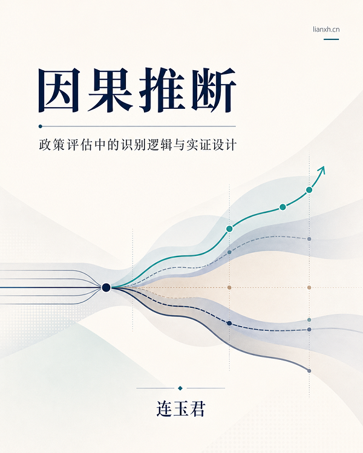

# 🏠 前言 {.unnumbered}

> **公开课一：Stata 简介与 AI 辅助实证**
>
> - 时间：2026 年 7 月 12 日 19:30–21:00（含 10 分钟答疑）
> - 主讲：连玉君（中山大学）
> - 直播 / 回放入口：<!-- TODO: 直播/回放入口 -->

## 简介

本课程面向「AI 时代如何学习和使用 Stata」。课程先从 Stata 的最小入口讲起——界面、dofile、工作目录、帮助文件与外部命令；再演示如何在 VS Code 中借助 Copilot 为 Stata 代码添加注释、补全命令、生成代码片段。

课程不会停留在「把代码贴进对话框、让 AI 解释几行命令」的层面，而是进一步展示**对话式 AI** 与**执行型 Agent** 在科研工作流中的分工：ChatGPT、Claude 适合帮我们拆解问题、制定计划、形成任务说明；Codex、Claude Code 则可以在本地项目里读写文件、执行脚本、整理结果。我们会结合一个简化项目，演示先用对话式 AI 规划任务，再交给 Agent 执行，最后由人检查、复核与迭代的完整过程。Stata 仍是实证研究的重要入口，但更重要的是理解数据结构、模型设定、识别策略与结果解释，并把多种软件和 AI 工具组织进一个清楚、可运行、可检查、可迭代的研究项目。

## 一条主线

本课程不从某一种软件讲起，而是从一条工作流主线讲起：

本课主线

研究问题→对话式 AI 拆解规划→任务说明书→Agent 在项目中执行→人来检查与迭代

Stata、Python、R 都是这条主线上可以替换的零件。每个模块都会回到这张图：先想清楚要解决什么问题，再决定用哪种工具、交给谁做、如何检查。

## 如何使用本仓库

本仓库使用 VS Code + Quarto 编写，并通过 GitHub Pages 发布。你可以：

- [Fork](https://github.com/lianxhcn/stata-ai/fork) 或克隆本仓库的 [GitHub 仓库](https://github.com/lianxhcn/stata-ai)，在本地阅读、修改、运行示例。

根据你的需要，有三条阅读路径：

1. **只想把环境配好** → 直接看 [环境配置](settings.qmd)。里面按「Stata 外部命令 → VS Code + nbstata → GitHub Copilot → Claude Code / Codex」四步给出配置清单与「配置成功的标志」。
2. **想复现课堂演示** → 下载本仓库的 `demo/` 文件夹，按其中的 `README.md` 操作，在文件夹内启动 Claude Code 或 Codex，即可重跑本课的 Agent 分析演示。
3. **想系统学习实证研究** → 欢迎报名 7 月 21–23 日的**连享会 2026 暑期班·初级班**（连玉君主讲）。今天公开课里看到的每一步，正式课上都会让你亲手做一遍。

### 连享会 2026 暑期班·初级班

- **时间**：2026 年 7 月 21–23 日（三天），连玉君（中山大学）
- **课程主页**：<https://www.lianxh.cn/PX.html>
- **报名链接**：<https://www.wjx.top/vm/QhgLvx1.aspx#>

扫码报名 · 2026 暑期班

------------------------------------------------------------------------

[主页](https://www.lianxh.cn) \| [课程](https://www.lianxh.cn/PX.html) \| [推文](https://www.lianxh.cn/blogs/all.html) \| [资料](https://www.lianxh.cn/share.html)
